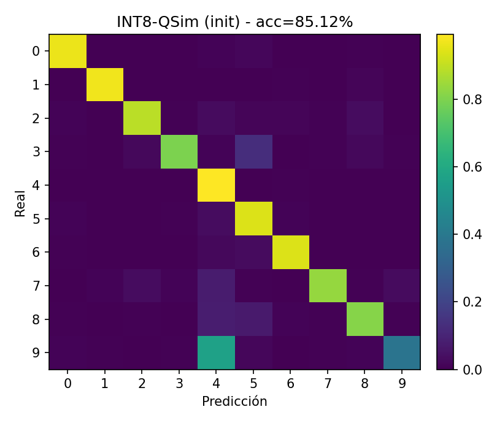
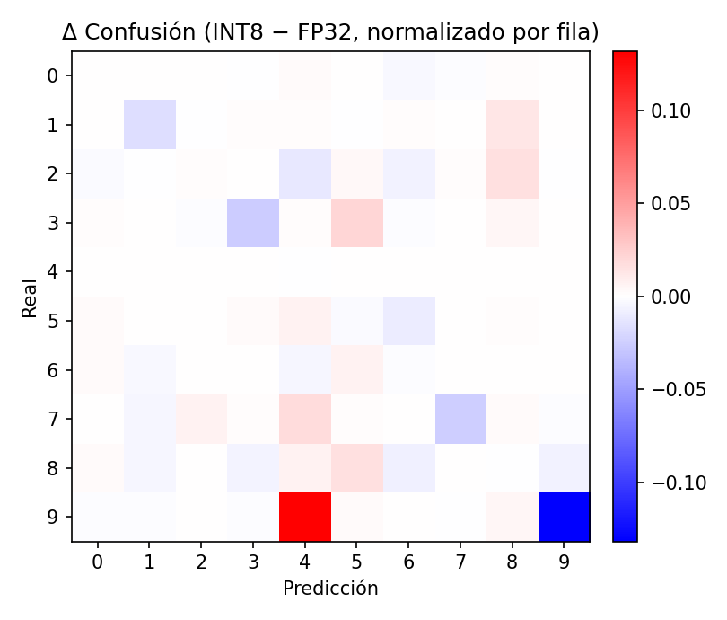
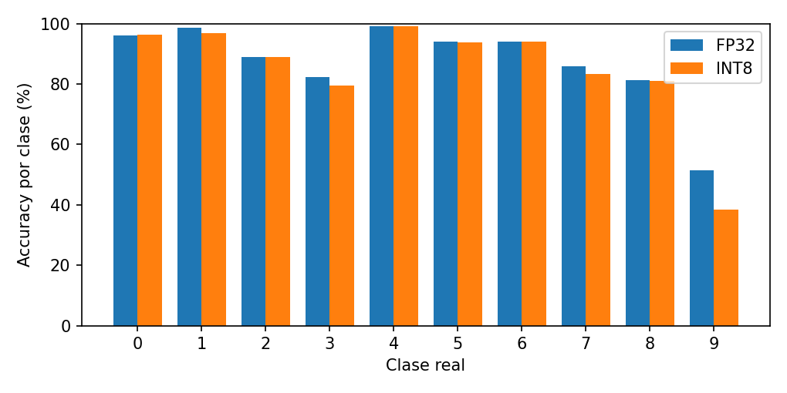

# Cuantización Post-Entrenamiento a INT8 con QSim (NumPy)

Implementamos un **motor educativo de ejecución cuantizada (QSim)** en **NumPy** y resolvemos un problema de optimización: **reducir tamaño** manteniendo la **precisión**.
El proyecto incluye memoria en LaTeX, código modular y dos notebooks explicativos centrados en las partes clave (cuantización y calibración).

---

## Resultados principales

| Modo      | Val (%) | Test (%) | Mean (ms) |  Tamaño  |
| --------- | :-----: | :------: | :-------: | :------: |
| FP32      |  86.44  |   87.19  |   2361.2  | 80.16 KB |
| INT8-QSim |  87.06  |   87.87  |   6316.4  | 20.04 KB |

* **Precisión**: INT8 iguala/ligeramente supera a FP32 en test (**+0.68 pts**).
* **Compresión**: **~4×** menos tamaño (80.16 → 20.04 KB).
* **Latencia**: el simulador **NumPy** no usa kernels optimizados → estos tiempos **no** son representativos de hardware con soporte INT8; se incluyen como verificación funcional del motor.

### Figuras

<p float="left">
  
  
</p>

<p float="left">
  
  
</p>

---

## Estructura del repositorio

```
.
├── memoria/                     # Memoria LaTeX (main.tex)  → CI genera main.pdf
│   └── main.pdf
├── notebooks/                   # Notebooks explicativos (solo NumPy)
│   ├── 01_quantizacion_y_engine.ipynb
│   └── 02_calibracion_y_busqueda.ipynb
├── src/                         # Código modular
│   ├── data.py                  # Carga dataset (MNIST/Fashion-MNIST)
│   ├── model_fp32.py            # LeNetLite (FP32) + utilidades
│   ├── quantizer.py             # Cuantización afín (escala/zero-point, per-tensor/per-channel)
│   ├── qsim_engine.py           # Conv/Linear INT8→INT32, requant, fusión ReLU
│   ├── calibrator.py            # Greedy de pesos y SA de percentiles
│   ├── profiler.py              # Medición de latencia
│   └── trainer.py               # Entrenamiento FP32 (utilizado por run_baseline)
├── run_baseline.py              # Entrena/evalúa FP32 y guarda baseline_fp32.npz
├── run_qsim.py                  # Pipeline PTQ → QSim → resultados y figuras
├── results/
│   ├── figuras/*.png
│   └── tablas/*.csv
└── .github/workflows/latex.yml  # CI para compilar la memoria
```

---

## Requisitos

* Python 3.9+ (probado con 3.12)
* Paquetes: `numpy`, `matplotlib` (opcional: `tqdm`)
* (Para la memoria) LaTeX + `biber` (**ya automatizado** vía GitHub Actions)


## Reproducir los resultados (línea de comandos)

1. **Baseline FP32**

```bash
python run_baseline.py
# -> genera results/baseline_fp32.npz y reporta accuracy
```

2. **PTQ + QSim INT8**

```bash
python run_qsim.py
# -> calibración (greedy + p=99, opcional SA)
# -> genera summary.csv y figuras en results/figuras
```

> Nota: las latencias provienen del motor NumPy (bucles claros, sin kernels SIMD). Sirven para validar el flujo de cuantización, no como benchmark de hardware.

---

## Notebooks (lo que explican)

* **`notebooks/01_quantizacion_y_engine.ipynb`**
  Explica y demuestra con ejemplos mínimos:

  * Cuantización afín: `affine_params`, `quantize`, `dequantize`.
  * Acumulación INT32 y re-cuantización: `conv2d_int`, `linear_int`, `requantize_int32`.
  * Fusión Conv+ReLU en cuantizado.
    **Conexión con memoria**: Sección 2 (Métodos) y Sección 3 (Implementación).

* **`notebooks/02_calibracion_y_busqueda.ipynb`**
  Documenta las heurísticas:

  * **Greedy por capa** para pesos (per-tensor/per-channel, sim/asim).
  * **Enfriamiento simulado (SA)** para percentiles de activación.
    **Conexión con memoria**: Sección 3 (pseudocódigo) y Sección 4 (ablación y resultados).

> Si abres los notebooks desde `notebooks/`, incluyen una celda que añade automáticamente la raíz del repo al `sys.path`. Asegúrate de que existe `src/__init__.py` (vacío).

---

## Mapa “Memoria ↔ Notebooks ↔ Código”

| Memoria                          | Notebook                        | Código                                    |
| -------------------------------- | ------------------------------- | ----------------------------------------- |
| §2 Métodos (ecuaciones)          | 01_quantizacion_y_engine.ipynb  | `src/quantizer.py`, `src/qsim_engine.py`  |
| §3 Implementación (pseudocódigo) | 01 y 02                         | `src/qsim_engine.py`, `src/calibrator.py` |
| §4 Experimentos y resultados     | 02_calibracion_y_busqueda.ipynb | `run_qsim.py`, `results/`                 |


---

## Licencia

Este repositorio se distribuye bajo la licencia indicada en `LICENSE`.
